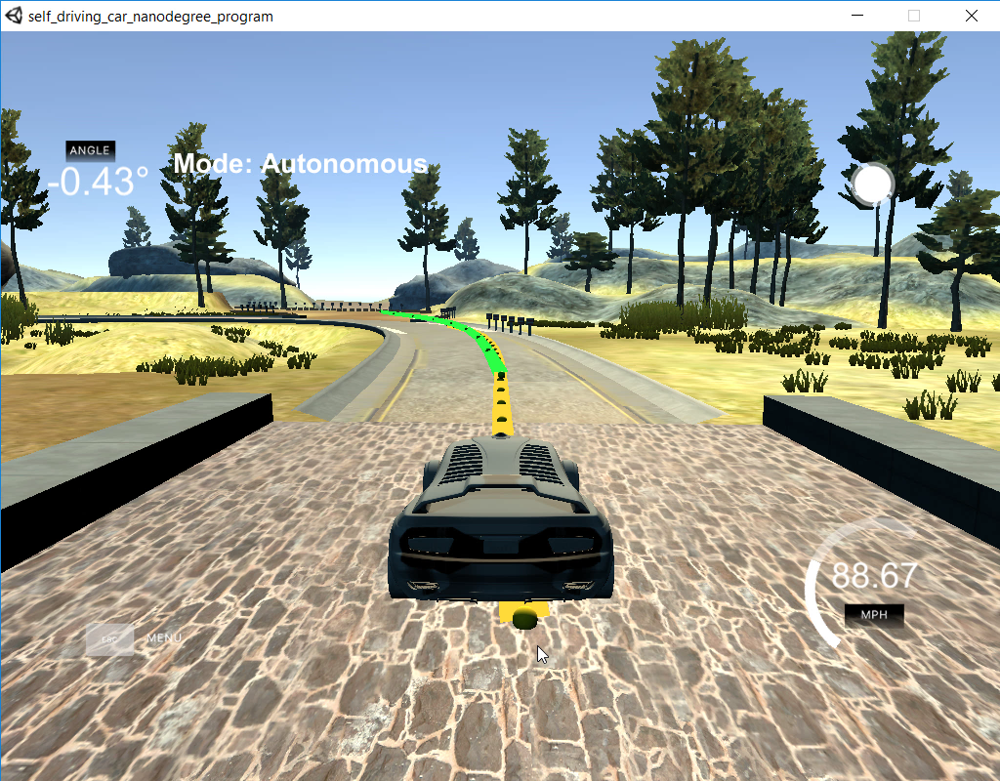

# Term 2 - Project 5 - Model Predictive Control

## Self-Driving Car Engineer Nanodegree Program

---

### Tom Chmielenski
#### March 2018

----

In this project, I implemented Model Predictive Control to drive a vehicle around the Udacity Term 2 Simulator track.

The goals of this project were to:

* Describe the state, actuators, and update equations using in our Model Predictive Contol (MPC).
* Choose approriate N (timestep length) and dt (elapsed duration between timestamp) values.
* Preprocess waypoints with by fitting a polynomial
* Handle a 100 millisecond latency between actuations with the MPC.
* Tune the cost function accordingly so the vehicle navigates the course correctly.

---

### Model Predictive Contol (MPC)

#### State

This project used a kinematic model who's model state consists of the vehicle's position (x, y), orientation angle (psi), velocity (v), cross track error(cte) and yaw error(epsi) as inputs.

#### Actuators

Outputs of this model were the actuators to control the steering angle (delta) and throttle value (a). The steering actuator is constrained between [-25 degrees, 25 degrees] and the throttle value is constrained between -1 for full brake and 1 for full acceleration.

#### Update Equations

Update Equations used in this model are:

~~~C++
// Lf, given for the simulator vehicle
double Lf = 2.67;

x_[t+1] = x[t] + v[t] * cos(psi[t]) * dt
y_[t+1] = y[t] + v[t] * sin(psi[t]) * dt
psi_[t+1] = psi[t] + v[t] / Lf * delta[t] * dt
v_[t+1] = v[t] + a[t] * dt
cte[t+1] = f(x[t]) - y[t] + v[t] * sin(epsi[t]) * dt
epsi[t+1] = psi[t] - psides[t] + v[t] * delta[t] / Lf * dt
~~~

where `Lf` is the distance between the front of the vehicle and its center of gravity.

---

### Number of Timesteps and Elapsed Duration (`N` & `dt`)

~~~C++
size_t N = 10;
double dt = 0.1;
double T = N * dt;
~~~

The prediction horizon (`T`) is the time duration over which predications are made.  It is the product of number of timesteps (`N`) * the time duration between actuations (`dt`).  It should be a short duration of a few seconds; as the environment can change rapidly and it don't make much sense to predict futher in time.

The number of timesteps (`N`) should be optimized as it is the major driver of the computational cost of the MPC.  The MPC attempts to approximate a continuous reference trajecory by means of discrete paths between actuations.

As the timestep duration (`dt`) increases, the result is less frequent actuations, which makes it harder to approximate an accurate reference trajectory.

Initially, I choose The number of timesteps (`N`) and the timestep duration (`dt`), as 10 and 0.1 respectively. Reading the Udacity forums and watching the [Self-Driving Car Project Q&A | MPC Controller](https://www.youtube.com/watch?v=bOQuhpz3YfU&feature=youtu.be) review video,
these values appeared to be good starting values and actually turned out to be the best parameters!

After my MPC cost function was tuned, I revisited these parameters to see if I could fine-tune the MPC by adjusting these values.

Increasing the number of timesteps caused the IPOPT solver to run slower since it had to optimize more control input values while trying to find the lowest cost.  Timesteps over 13 caused the vehicle to go off the track with a reference velocity of 70 MPH.

Here is a list of values attempted:

  |N|dt|T|
  |---|---|---|
  |10|0.1|100|
  |20|0.1|200|
  |20|0.2|400|
  |15|0.1|150|
  |13|0.1|130|
  |10|0.2|200|
  |10|0.05|50|

---

### Reference Velocity

Tuning the cost functions appropriately allowed to reach the vehicle to reach close to 100 MPH Reference velocity (`ref_v`).

~~~C++
const double ref_v = 100; // reference of 100 mph
~~~

### Preprocess waypoints

The coordinate system in the code is not the same as in the Unity Simulator.  For example, 0 degrees in code corresponds to 90 degrees in the simulator.  When `psi` is returned from the simulator, we need to transform it before solving, and then transform it back when sending the steering value back to the simulator.

~~~C++
// psi                           psi in unity
//          90                           0/360
//          |                              |
//  180 ----+----  0/360           270 ----+----  90
//          |                              |
//         270                            180
~~~

In addition, before we pass the waypoints to the solver, we shift the waypoints to the vehicle's coordinate system by setting vehicle's x and y coordinates to be the origin (0, 0) and its' orientation angle to zero. This will simplify our calculations and will make our code less error prone.

~~~C++
// Simplify calculation by shifting to cars reference angle
for (unsigned int i = 0; i < ptsx.size(); i++) {
    // shift car reference angle to 90 degrees
    double shift_x = ptsx[i] - px;
    double shift_y = ptsy[i] - py;

    ptsx[i] = (shift_x * cos(0 - psi) - shift_y * sin(0 - psi));
    ptsy[i] = (shift_x * sin(0 - psi) + shift_y * cos(0 - psi));
}

// Convert from vector<double> to Eigen::VectorXd
double* ptrx = &ptsx[0];
Eigen::Map<Eigen::VectorXd> ptsx_transform(ptrx, 6);
double* ptry = &ptsy[0];
Eigen::Map<Eigen::VectorXd> ptsy_transform(ptry, 6);
~~~

I used a third order polynominal to fit the 6 waypoints. Third order polynominials will be good enough to approximate trajectories for most roadways.

~~~C++
//  Third order polynominal will fit trajectories for most roadways
auto coeffs = polyfit(ptsx_transform, ptsy_transform, 3);
~~~

And remember:  we need to transform the steering value before sending it to the actuator.

~~~C++
steer_value = -vars[0] / deg2rad(25);`
~~~

---

### Latency

In this model, I assume a 100 miliseconds latency between the acuation command and when it is actually executed.  In a real vehicle, the latency would be very similar to our assumption.

Since I chose a timestep duration (`dt`)  equal to 0.1 (100 milliseconds), we set the state to time `t+1` rather than the current state at time `t`.  MPCs handle latency more effectively by accounting for this, whereas PID Controllers can not.

~~~C++
// Latency of 100ms
bool includeLatency = true;
if (includeLatency) {
  //use steering_angle and throttle, use for delay.
  //throttle is not the same as acceleration
  // for low delays, it will work as an estimator.
  double steer_value = j[1]["steering_angle"];
  double throttle_value = j[1]["throttle"];

  const double latency = 0.1;    // 100 ms 

  double lat_px = v * latency;
  double lat_py = 0.0;
  double lat_psi = v * -(steer_value / Lf) * latency;
  double lat_v = v + throttle_value * latency;
  double lat_cte = cte * v * sin(epsi) * latency;
  double lat_epsi = epsi + lat_psi;

  state << lat_px, lat_py, lat_psi, lat_v, lat_cte, lat_epsi;  
} else {
  state << 0, 0, 0, v, cte, epsi;  // no latency
}

~~~

---

### Cost Function

Our cost function was tuned to punish CTE, epsi, the difference between
velocity and a reference velocity, delta (steering angle), acceleration, and a change in delta and acceleration between `t` and `t+1`.

In the first loop, we take care of our main objective - to minimize the cross track, the heading, and velocity errors.  The cross track and heading errors were weighted the highest of all the factors.

In the second loop, turning should be smooth, not sharp, and the velocity should change gradually.

In the final loop, control decisions are made more consistent, or smoother to the current one.

~~~C++
const double wgt_cte = 2500;
const double wgt_epsi = 2500;
const double wgt_v = 1;
const double wgt_delta_start = 10;
const double wgt_a_start = 10;
const double wgt_change_delta = 250;
const double wgt_change_a = 10;

// Reference State Cost
// tune by setting  coefficients to how much attention to pay attention to attributes
for (unsigned int i = 0; i < N; i++) {
    fg[0] += wgt_cte * CppAD::pow(vars[cte_start + i] - ref_cte, 2);
    fg[0] += wgt_epsi * CppAD::pow(vars[epsi_start + i] - ref_epsi, 2);
    fg[0] += wgt_v * CppAD::pow(vars[v_start + i] - ref_v, 2);
}

for (unsigned int i = 0; i < N - 1; i++) {
    fg[0] += wgt_delta_start * CppAD::pow(vars[delta_start + i], 2);
    fg[0] += wgt_a_start * CppAD::pow(vars[a_start + i], 2);
}

//delta_start = steering angle  jerkiness
for (unsigned int i = 0; i < N - 2; i++) {
    fg[0] += wgt_change_delta * CppAD::pow(vars[delta_start + i + 1] 
                - vars[delta_start + i], 2);
    fg[0] += wgt_change_a * CppAD::pow(vars[a_start + i + 1] 
                - vars[a_start + i], 2);
}
~~~

---

### Results

The cross track and steering angle errors were tuned first, then the smoothness of the turning and acceleration was tuned.  Last, the smoothness between actuations was tuned.  The vehicle was then able to navigate the simulator course at speeds up to 100 MPH!

